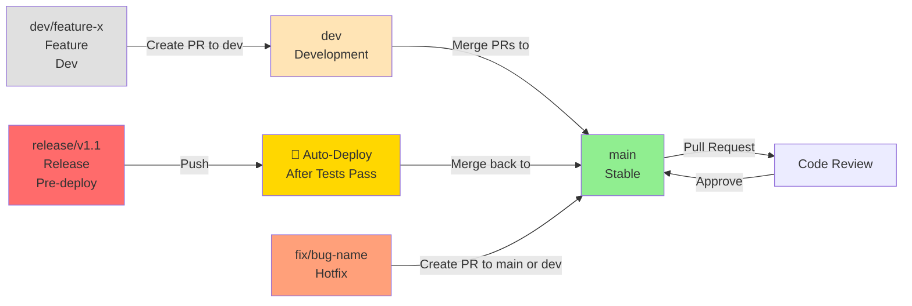

# Folder Structure After DevOps Reorganization

## Visual Structure Overview

```mermaid
graph TD
    A["📁 Webpage_presentation/"] --> B["📁 src/"]
    A --> C["📁 dev/"]
    A --> D["📁 prod/"]
    A --> E["📁 tests/"]
    A --> F["📁 docs/"]
    A --> G["📁 .github/"]
    A --> H["📄 CLAUDE.md"]
    A --> I["📄 README.md"]
    A --> J["📄 .gitignore"]

    B --> B1["🌟 portfolio.html"]
    B1 --> B1a["Development Source<br/>Main Working File<br/>✏️ Edit Only This"]

    C --> C1["🔗 portfolio.html"]
    C1 --> C1a["Symlink to src/<br/>Local Dev Reference<br/>Optional"]

    D --> D1["🚀 portfolio.html"]
    D1 --> D1a["Production Live<br/>✋ CI/CD Generated<br/>Never Edit Manually"]

    D --> D2["📁 backups/"]
    D2 --> D2a["portfolio-backup-20260407_143022.html"]
    D2 --> D2b["portfolio-backup-20260407_120000.html"]
    D2 --> D2c["... older backups ..."]
    D2a --> D2a_note["Auto-created<br/>Timestamped<br/>Immutable"]

    E --> E1["🧪 validate-html.sh"]
    E --> E2["🧪 validate-css.js"]
    E --> E3["🧪 validate-js.js"]
    E --> E_note["Validation Scripts<br/>Run by CI/CD"]

    F --> F1["📋 CLAUDE.md"]
    F --> F2["📋 IMPLEMENTATION_PLAN.md"]
    F --> F3["📋 DEPLOYMENT.md"]
    F --> F4["📋 PROJECT_EVOLUTION_SUMMARY.md"]
    F1 --> F1_note["Architecture & Setup"]
    F2 --> F2_note["Implementation<br/>Checklist"]
    F3 --> F3_note["Operations<br/>Runbook"]
    F4 --> F4_note["Executive Summary"]

    G --> G1["📁 workflows/"]
    G1 --> G1a["jekyll-docker.yml"]
    G1a --> G1a_note["Existing<br/>Keep if needed"]

    G1 --> G1b["🆕 portfolio-pipeline.yml"]
    G1b --> G1b_note["NEW: CI/CD Pipeline<br/>test-only & test+deploy"]

    H --> H_note["Project Documentation<br/>+ Guidance"]

    J --> J_note["Excludes: prod/backups/"]

    style B1 fill:#90EE90,stroke:#228B22,stroke-width:2px
    style D1 fill:#FF6B6B,stroke:#CC0000,stroke-width:2px
    style D2 fill:#87CEEB,stroke:#0066CC,stroke-width:2px
    style G1b fill:#FFD700,stroke:#FF8C00,stroke-width:2px
```



---

## Data Flow Diagram: CI/CD Pipeline

```mermaid
graph LR
    EDIT["✏️ src/portfolio.html<br/>Development"]
    COMMIT["📝 git commit<br/>& push"]
    CITEST["🧪 CI: Test Only<br/>HTML/CSS/JS<br/>Auto on main/dev"]
    DEPLOY["🚀 CI: Deploy<br/>Create backup<br/>Copy to prod/"]
    PROD["✅ prod/portfolio.html<br/>Live"]
    BACKUP["💾 prod/backups/<br/>Timestamped"]
    TAG["🏷️ Git Tag<br/>deployed-...]

    EDIT --> COMMIT
    COMMIT --> CITEST
    CITEST -->|Pass| DEPLOY
    DEPLOY --> PROD
    DEPLOY --> BACKUP
    DEPLOY --> TAG
    CITEST -->|Fail| EDIT

    style EDIT fill:#90EE90
    style PROD fill:#FF6B6B
    style BACKUP fill:#87CEEB
    style TAG fill:#FFD700
    style CITEST fill:#FFA500
    style DEPLOY fill:#FF8C00
```

---

## Quick Reference Table

| Folder/File | Purpose | Edit? | Managed By |
|---|---|---|---|
| **src/portfolio.html** | Development source | ✅ YES | Developer |
| **dev/portfolio.html** | Local dev symlink | ❌ NO (symlink) | Git |
| **prod/portfolio.html** | Production live | ❌ NO (CI/CD) | GitHub Actions |
| **prod/backups/** | Timestamped backups | ❌ NO (auto) | CI/CD Pipeline |
| **tests/** | Validation scripts | ✅ YES | Developer |
| **docs/** | Project documentation | ✅ YES | Developer |
| **.github/workflows/portfolio-pipeline.yml** | CI/CD configuration | ✅ YES | Developer |
| **CLAUDE.md** | Architecture guide | ✅ YES | Developer |

---

## Detailed Environment Breakdown

### 🟢 DEVELOPMENT (src/)

```
src/portfolio.html
├─ This is where you work
├─ Main single source of truth
├─ Contains all HTML/CSS/JavaScript
└─ Committed to git (tracked)
```

**When to edit**: Always
**How to edit**: `nano src/portfolio.html` or your editor
**After editing**: `git add src/portfolio.html` → `git commit` → `git push`

---

### 🟡 LOCAL DEV (dev/)

```
dev/portfolio.html (symlink → src/portfolio.html)
├─ Optional convenience copy
├─ Allows local preview without src/ path
├─ Symlink = always points to latest src/
└─ NOT typically used (optional)
```

**When to use**: Personal local testing convenience
**How to create**: `ln -s ../src/portfolio.html dev/portfolio.html`
**To edit**: Use `src/portfolio.html` instead (symlink auto-updates)

---

### 🔴 PRODUCTION (prod/)

```
prod/portfolio.html
├─ Live portfolio file
├─ Served to users/browser
├─ AUTO-GENERATED by CI/CD
├─ NEVER manually edited
└─ Copied from src/ after tests pass
```

**When created**: After successful CI/CD deployment
**Who manages it**: GitHub Actions (automated)
**If broken**: Rollback from backups

---

### 💾 BACKUPS (prod/backups/)

```
prod/backups/
├─ portfolio-backup-20260407_143022.html  (most recent)
├─ portfolio-backup-20260407_120000.html
├─ portfolio-backup-20260407_094500.html
└─ ... historical backups ...
```

**Created**: Before every deployment
**Format**: `portfolio-backup-{YYYYMMDD}_{HHMMSS}.html`
**Kept**: Forever (never auto-deleted)
**Use for**: Emergency rollback if prod breaks

---

### 🧪 TESTS (tests/)

```
tests/
├─ validate-html.sh          Run HTML validation
├─ validate-css.js           Check CSS syntax
└─ validate-js.js            Check JavaScript syntax
```

**Run by**: GitHub Actions CI/CD
**Created**: Before deploying to prod
**Edit if**: Validation rules need updating

---

### 📋 DOCS (docs/)

```
docs/
├─ CLAUDE.md                       → In root, but also here for reference
├─ IMPLEMENTATION_PLAN.md          → How to implement reorganization
├─ DEPLOYMENT.md                   → Operations runbook (how to deploy)
├─ PROJECT_EVOLUTION_SUMMARY.md    → Executive summary (start here)
└─ README.md                       → Project overview
```

**Read order**:
1. PROJECT_EVOLUTION_SUMMARY.md (overview)
2. CLAUDE.md (architecture details)
3. IMPLEMENTATION_PLAN.md (step-by-step)
4. DEPLOYMENT.md (operations)

---

### ⚙️ CI/CD WORKFLOWS (.github/workflows/)

```
.github/workflows/
├─ jekyll-docker.yml               (existing, keep if needed)
└─ portfolio-pipeline.yml          (NEW - your main deployment pipeline)
       ├─ Mode A: test-only        (default, auto on all pushes)
       └─ Mode B: test+deploy      (manual approval for production)
```

**Triggered by**:
- `main` push → Mode A (auto-test)
- `dev` push → Mode A (auto-test)
- `release/v*` push → Mode B (auto-deploy after passing)
- Manual workflow dispatch → Choose Mode A or B

---

## File Size Reference (After Reorganization)

| Item | Size | Notes |
|---|---|---|
| `src/portfolio.html` | ~35KB | Single file contains all HTML/CSS/JS |
| `prod/portfolio.html` | ~35KB | Identical copy (managed by CI/CD) |
| `dev/portfolio.html` | ~0 bytes | Symlink (no actual file) |
| Backup files (each) | ~35KB | Accumulate over time |
| `tests/*.sh` | ~2-3KB | Validation scripts |
| `docs/*.md` | ~6-9KB | Documentation files |
| **Total project** | ~150-200KB | Depending on number of backups |

---

## Branch Strategy After Reorganization



---

## Key Actions After Reorganization

### Daily Development
```bash
git checkout -b dev/my-feature          # Create feature branch
nano src/portfolio.html                 # Edit source file
git add src/portfolio.html              # Stage changes
git commit -m "Add new skill nodes"     # Commit
git push origin dev/my-feature          # Push (auto-tests)
# → Create PR to dev on GitHub
```

### Deploying to Production
```bash
git checkout -b release/v1.1            # Create release branch
git push origin release/v1.1            # Push (auto-deploys after tests)
# → Wait 2-3 minutes
# → prod/portfolio.html updated
# → prod/backups/portfolio-backup-*.html created
```

### Emergency Rollback
```bash
cp prod/backups/portfolio-backup-20260407_120000.html prod/portfolio.html
git add prod/portfolio.html
git commit -m "Rollback: Emergency fix"
git push origin main
```

---

## Migration Checklist: From Current to New Structure

- [ ] Create folders: `mkdir -p src dev prod tests prod/backups docs`
- [ ] Move file: `mv portfolio.html src/portfolio.html`
- [ ] Create symlink (optional): `ln -s ../src/portfolio.html dev/portfolio.html`
- [ ] Create CI/CD workflow: `.github/workflows/portfolio-pipeline.yml`
- [ ] Add validation scripts: `tests/validate-html.sh` (etc)
- [ ] Add to .gitignore: `prod/backups/` (except one example backup)
- [ ] Commit structure: `git add src/ dev/ prod/ tests/ docs/ .github/`
- [ ] Test workflow: Push test branch and verify GitHub Actions runs
- [ ] Document in README: Link to CLAUDE.md and DEPLOYMENT.md

---

## Summary: What Changed

| Before | After | Benefit |
|---|---|---|
| `portfolio.html` in root | `src/portfolio.html` | Clear development source |
| No version control | `prod/` managed by CI/CD | Audit trail, safety |
| Manual deploy | Automated pipeline | Consistent, repeatable |
| No backups | Auto-timestamped backups | Fast rollback (< 5 min) |
| No folder structure | DevOps-compliant org | Scalable, professional |
| No CI/CD | Two-mode pipeline | Test-only or test+deploy |

---

**Status**: 📋 Plan Complete, Ready to Implement
**Next Step**: Execute migration checklist above
**Questions**: See `docs/CLAUDE.md` or `docs/DEPLOYMENT.md`
