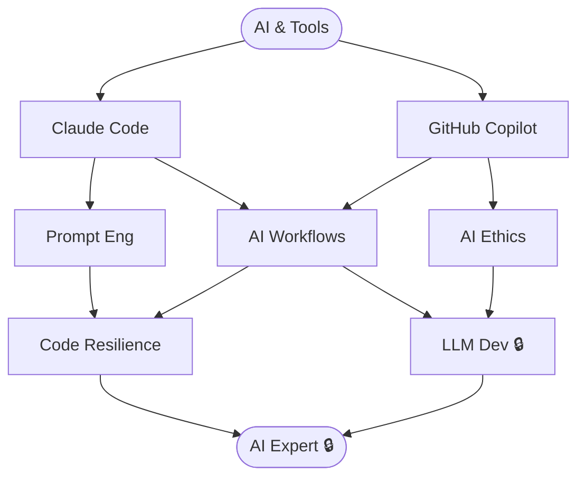

# AI & Dev Tools

**Level:** 40 · Certified
**Focus:** Claude Code + AI Fluency certified. AI accelerates dev while maintaining code independence.

## Nodes
- [[AI & Tools]] (root)
- [[Claude Code]]
- [[GitHub Copilot]]
- [[Prompt Eng]]
- [[AI Workflows]]
- [[AI Ethics]]
- [[Code Resilience]]
- [[LLM Dev]] 🔒
- [[AI Expert]] 🔒

## Constellation

