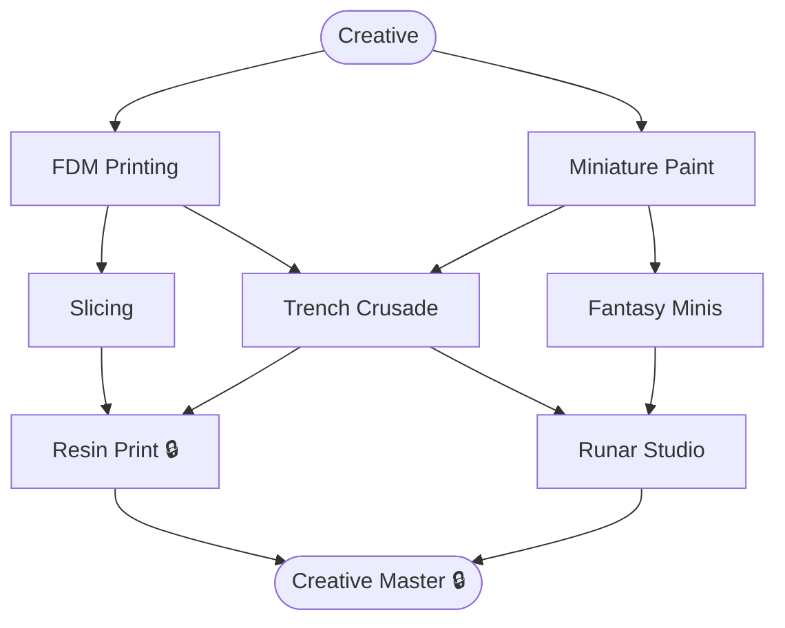

# Creative & 3D

**Level:** 35 · Advanced
**Focus:** 3D printing, miniature painting, and portfolio design under the Runar Studio / Runar Forge brand.

## Nodes
- [[Creative]] (root)
- [[FDM Printing]]
- [[Miniature Paint]]
- [[Slicing]]
- [[Trench Crusade]]
- [[Fantasy Minis]]
- [[Resin Print]] 🔒
- [[Runar Studio]]
- [[Creative Master]] 🔒

## Constellation

