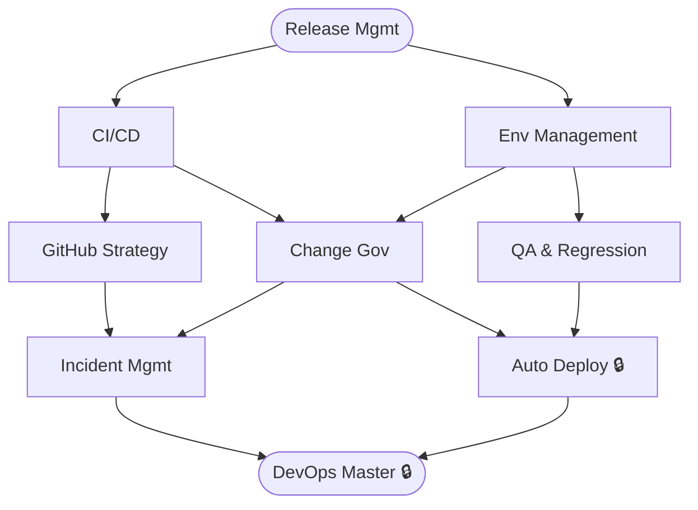

# DevOps & Release Management

**Level:** 80 · Expert
**Focus:** Release Manager for INT/UAT/PROD environments. Scheduling, governance, change control.

## Nodes
- [[Release Mgmt]] (root)
- [[CI-CD]]
- [[Env Management]]
- [[GitHub Strategy]]
- [[Change Gov]]
- [[QA & Regression]]
- [[Incident Mgmt]]
- [[Auto Deploy]] 🔒
- [[DevOps Master]] 🔒

## Constellation

