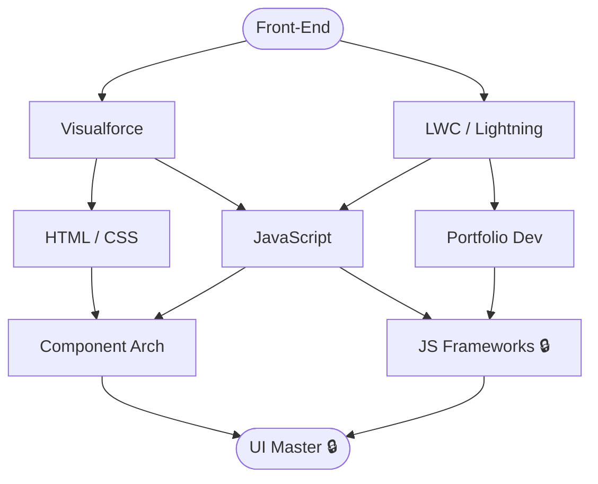

# UI / Front-End

**Level:** 65 · Advanced
**Focus:** HTML/CSS/JS across LWC and Visualforce. Portfolio built with vanilla stack.

## Nodes
- [[Front-End]] (root)
- [[Visualforce]]
- [[LWC - Lightning]]
- [[HTML - CSS]]
- [[JavaScript]]
- [[Portfolio Dev]]
- [[Component Arch]]
- [[JS Frameworks]] 🔒
- [[UI Master]] 🔒

## Constellation

