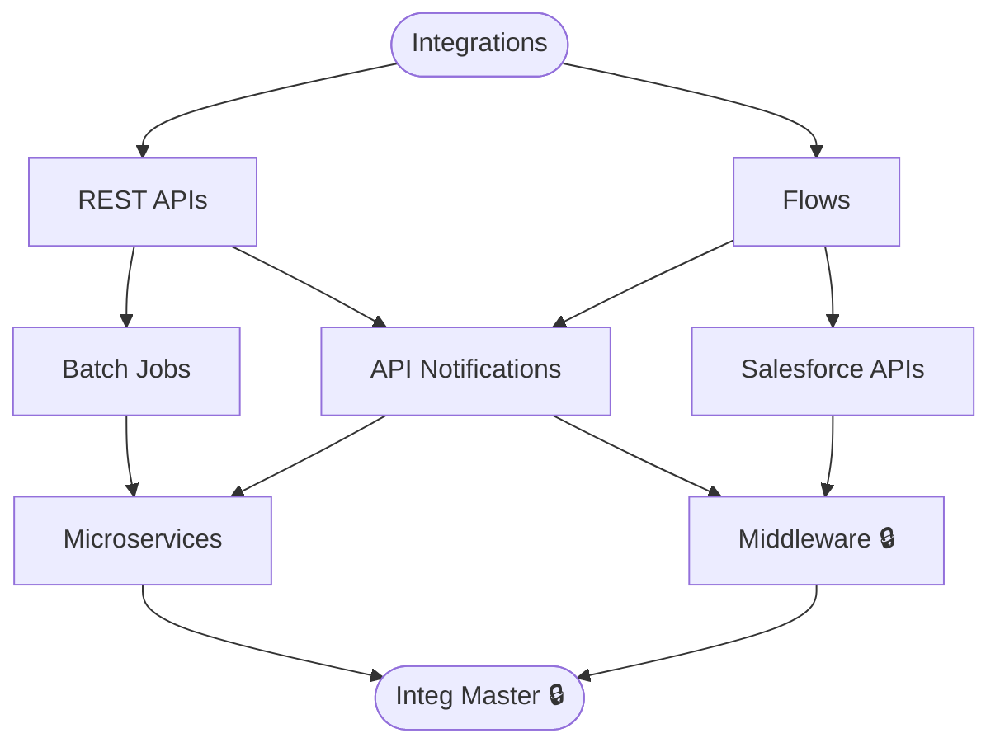

# Integrations & Automation

**Level:** 75 · Expert
**Focus:** REST API integrations connecting Salesforce with external tools across multiple environments.

## Nodes
- [[Integrations]] (root)
- [[REST APIs]]
- [[Flows]]
- [[Batch Jobs]]
- [[API Notifications]]
- [[Salesforce APIs]]
- [[Microservices]]
- [[Middleware]] 🔒
- [[Integ Master]] 🔒

## Constellation

