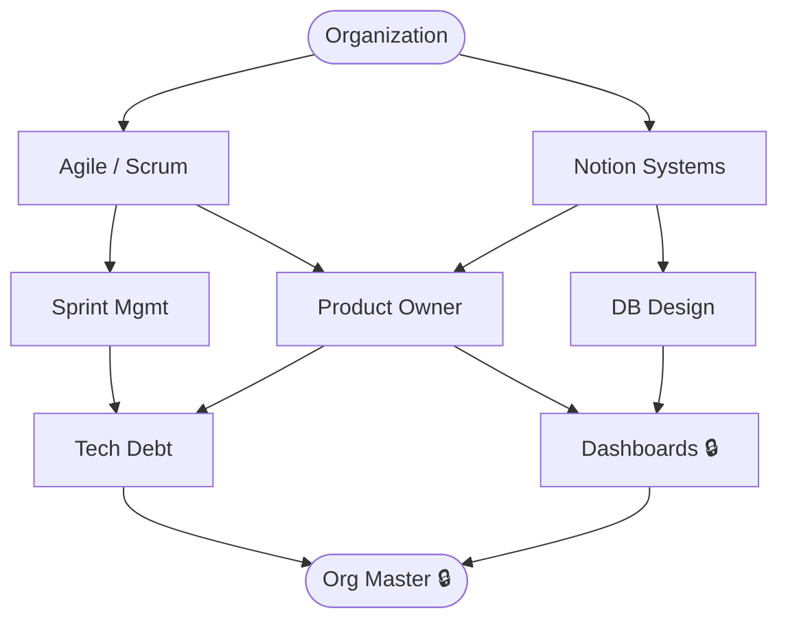

# Organization & Agile

**Level:** 70 · Expert
**Focus:** End-to-end project ownership — requirement gathering to production release across multi-country teams.

## Nodes
- [[Organization]] (root)
- [[Agile - Scrum]]
- [[Notion Systems]]
- [[Sprint Mgmt]]
- [[Product Owner]]
- [[DB Design]]
- [[Tech Debt]]
- [[Dashboards]] 🔒
- [[Org Master]] 🔒

## Constellation

