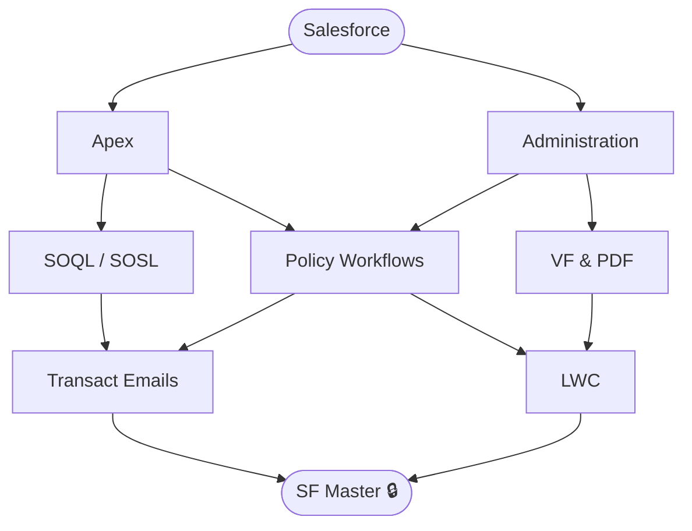

# Salesforce Core

**Level:** 90 · Expert
**Focus:** 6+ years across full Salesforce stack — dev, admin, Release Management, BAU, Product Owner.

## Nodes
- [[Salesforce]] (root)
- [[Apex]]
- [[Administration]]
- [[SOQL - SOSL]]
- [[Policy Workflows]]
- [[VF & PDF]]
- [[Transact Emails]]
- [[LWC]]
- [[SF Master]] 🔒

## Constellation

